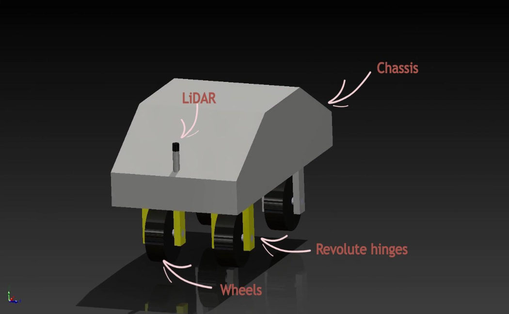

# ENPM 662: Project 1

## Project title: CAD Modelling & Simulation using Gazebo
### Robot Image:
<p align="center">



</p>

### Dependencies:
* ROS Controller package and controller manager
```bash
sudo apt install ros-galactic-ros2-control ros-galactic-ros2-controllers ros-galactic-gazebo-ros2-control
sudo apt-get install ros-galactic-controller-manager
```

### Steps to execute the project:
* Create a ROS2 workspace.

* git clone the package in your ros2 workspace.:
```
cd ros2_ws/src
git clone "link to repository"
```

* Source your bashrc and ROS2 version, build your package, and Source your workspace. 
```bash
cd ros2_ws/
source /opt/ros/"ROS2_DISTRO"/setup.bash
colcon build
source "WS_DIRECTORY"/install/setup.bash
```

- To spawn the model in empty world for teleop:
```bash 
source "WS_DIRECTORY"/install/setup.bash
ros2 launch car_robot gazebo.launch.py
```
Then open second terminal:-
```bash
source WS_DIRECTORY/install/setup.bash
ros2 run car_robot teleop.py
```

* To spawn the model in competition world for teleop:
```bash
source WS_DIRECTORY/install/setup.bash
ros2 launch car_robot competition.launch.py

```
Open second terminal:-
```source "WS_DIRECTORY"/install/setup.bash
ros2 run car_robot teleop.py
```

* To run the proportional controller make sure the position and orientation values in `spawn_robot_ros2.launch.py` are 0. For running the proportional controller:
```bash 
source WS_DIRECTORY/install/setup.bash
ros2 launch car_robot gazebo.launch.py
ros2 run car_robot proportional_controller.py
```
### Results:
- [Teleop](https://drive.google.com/file/d/1xQ3izmXtTUS3wwKu2IvfoMDJHHOfLkgd/view?usp=drive_link) 
- [Porportional Controller](https://drive.google.com/file/d/1H158rpDP9aivAv4KUmNPMN3PQegJCEjk/view?usp=drive_link) 